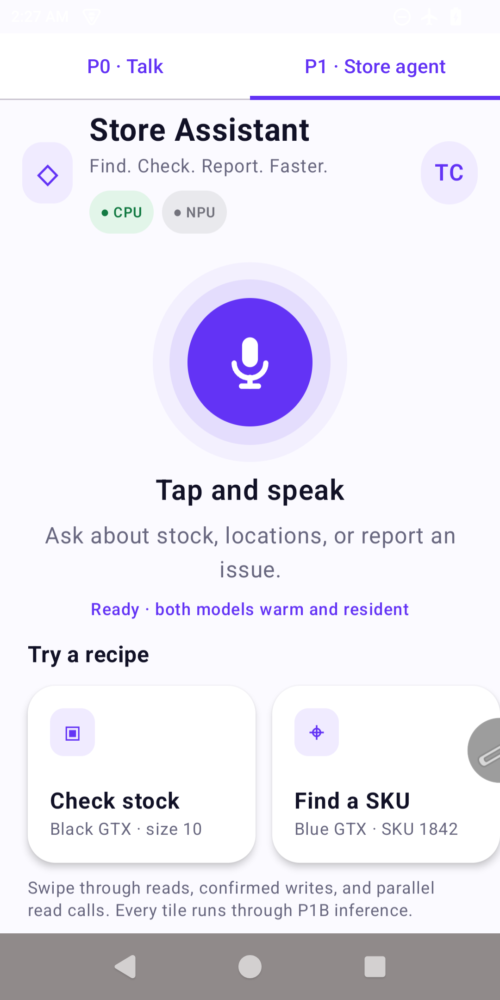
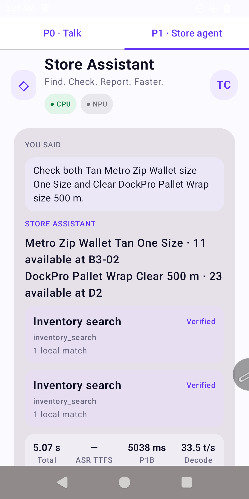

# Zebra Local Store Assistant

An offline-first Android demo that runs Liquid AI models locally on a Zebra TC501 warehouse handheld. A worker can speak a request or tap a recipe, the app infers native tool calls, applies a strict Kotlin policy boundary, and reads or writes a synthetic warehouse database without cloud inference.

> Demo software, not a production warehouse-management system.

## Demo

<p align="center">
  
  &nbsp;&nbsp;
  
</p>

The current build provides one focused Store Assistant experience:

- Audio or recipe text to schema-free native tool calls, with bounded
  three-turn clarification, expansion, and correction by voice.
- Five allowlisted tools: `inventory_search`, `location_contents`, `get_task_status`, `report_issue`, and `request_replenishment`.
- Parallel independent reads, with each call isolated during retrieval.
- Confirmation before every write; reads execute immediately.
- SQLite-backed synthetic catalog, tasks, issues, and replenishment requests.
- Persistent model servers for warm turns and visible latency/throughput metrics.
- Temporary WAV capture that is deleted after local inference.

## Architecture

```mermaid
flowchart LR
    Mic[Android microphone] --> WAV[Temporary 16 kHz WAV]
    WAV --> Audio[LFM2.5-Audio 1.5B Q4<br/>persistent llama.cpp server · CPU]
    Audio --> Transcript[Text transcript]
    Recipes[On-screen recipe] --> ToolModel
    Transcript --> ToolModel[LFM2.5-350M P1B v4 Q4_K<br/>schema-free tool inference · CPU]
    ToolModel --> Parser[Strict native-call parser<br/>allowlisted names + arguments]
    Parser --> Policy{Kotlin policy boundary}
    Policy -->|independent read| ReadAdapters[Inventory / location / task adapters]
    Policy -->|single write proposal| Confirm[User confirmation]
    Confirm --> WriteAdapters[Issue / replenishment adapters]
    ReadAdapters --> SQLite[(Demo-only local SQLite<br/>replaceable repository)]
    WriteAdapters --> SQLite
    SQLite --> Verify[Deterministic result + verification]
    Verify --> UI[Compose UI + tool traces + metrics]
```



The model decides which supported tool to request and emits its arguments. It never generates or executes SQL. Parameterized repository code performs database operations after parsing and policy checks.

### Demo data boundary

The bundled catalog, task records, SQLite schema, and seeded issue/replenishment tables exist only to make the tool calls testable in this standalone demo. They are not part of the LFM weights, LoRA adapter, prompt contract, or model harness. A real deployment would normally replace `SqliteWarehouseRepository` with the application's existing WMS, database, or local API adapter and omit the synthetic fixtures and table seeding.

## Target and runtime

- Zebra TC501-class Android device
- `arm64-v8a`, Android 12+ (`minSdk 31`)
- Verified development SKU: QCM6690 / Volcano, 8 CPU cores, approximately 12 GB RAM
- Current backend: CPU. NPU execution is intentionally shown as inactive because it is not wired in this prototype.
- UI: Kotlin + Jetpack Compose
- Local inference: Liquid-compatible `llama.cpp` Android servers

### Measured TC501 footprint

Snapshot taken after both models were warm and a P1 parallel-read request completed:

| Process | PSS | RSS |
|---|---:|---:|
| Compose application | 130 MiB | 268 MiB |
| LFM2.5-Audio server | 1,725 MiB | 1,728 MiB |
| LFM2.5-350M P1B server | 471 MiB | 474 MiB |
| **Warm total** | **2.27 GiB** | **2.41 GiB** |

The snapshot reported zero swap. Memory varies with request length, allocator state, and Android accounting, so treat it as an observed demo footprint rather than a guaranteed ceiling.

The active model set requires approximately **1.35 GiB** of app-private storage. The development device currently uses **1.71 GiB** because it also retains a previous 362 MiB P1B checkpoint. The synthetic SQLite database is only about 108 KiB and is not a meaningful part of either the RAM or storage footprint.

Two persistent model processes are used:

| Stage | Model artifact | Purpose |
|---|---|---|
| Audio | `LFM2.5-Audio-1.5B-Q4_0.gguf` plus projector, tokenizer, and vocoder | Speech understanding / transcription |
| Tool agent | `LFM2.5-350M-P1B-SchemaFree-v4-Q4_K.gguf` | Native function-call generation |

Model weights and native `.so` runtime binaries are deliberately excluded from Git. Obtain them under their respective licenses and place/import them as described in the [developer runbook](docs/DEV_RUNBOOK.md). The MIT license in this repository covers this project's code and documentation only—not Liquid model weights or third-party runtime binaries.

## Repository map

```text
android/       Android application and tests
data_gen/      LQH synthetic-data generator
datasets/      Synthetic training/evaluation datasets and metadata
docs/          Scope, runbooks, contracts, roadmap, and screenshots
evals/         Tool-calling evaluation rubric
prompts/       Frozen P1B system contract
scripts/       Dataset, evaluation, conversion, and smoke-test utilities
seed_data/     Demo-only synthetic catalog and task fixtures
```

## Build and test

Prerequisites:

- Android Studio with JDK 17
- Android SDK 36
- An authorized `arm64-v8a` Android device available through ADB
- Required Liquid native libraries in `android/app/src/main/jniLibs/arm64-v8a/`
- The model artifacts listed above

Build from the checked-in Gradle wrapper:

```bash
cd android
./gradlew testDebugUnitTest assembleDebug assembleDebugAndroidTest
```

Install the debug build:

```bash
adb install -r app/build/outputs/apk/debug/app-debug.apk
```

At first launch, use the model importer to copy and checksum the audio bundle and trained P1B GGUF into app-private storage. Subsequent requests reuse the resident servers until the app process is stopped.

For the complete device setup, model filenames/checksums, ADB tests, and troubleshooting, use the [developer runbook](docs/DEV_RUNBOOK.md) and [system check](docs/SYSTEM_CHECK.md).

## Training and data

The P1B checkpoint was trained with LQH 0.23 using synthetic warehouse requests grounded in the catalog and task fixtures. The promoted balanced v4 build internalizes the frozen five-tool contract, so Android sends a short schema-free system prompt instead of injecting full JSON schemas on every request.

Useful references:

- [Current state and roadmap](docs/CURRENT_STATE_AND_ROADMAP.md)
- [P1B training plan](docs/P1B_TRAINING_PLAN.md)
- [Schema ablation](docs/P1B_SCHEMA_ABLATION.md)
- [P1 app/tool contract](docs/P1A_APP_CONTRACT.md)
- [Warehouse demo specification](docs/WAREHOUSE_DEMO.md)
- [Project scope](docs/PROJECT_SCOPE.md)

## Safety boundary

- At most three independent reads may be emitted in one turn.
- A write must be the only action in its turn.
- Writes remain proposals until explicitly confirmed in the UI.
- Unknown tools, unknown arguments, malformed output, mixed read/write batches, and incomplete writes are rejected or clarified.
- Catalog facts come from SQLite, not model memory.
- No cloud service is used by the Android runtime path.

## License

Project code and documentation are available under the [MIT License](LICENSE). Third-party dependencies, native runtime binaries, and model weights retain their own licenses.
